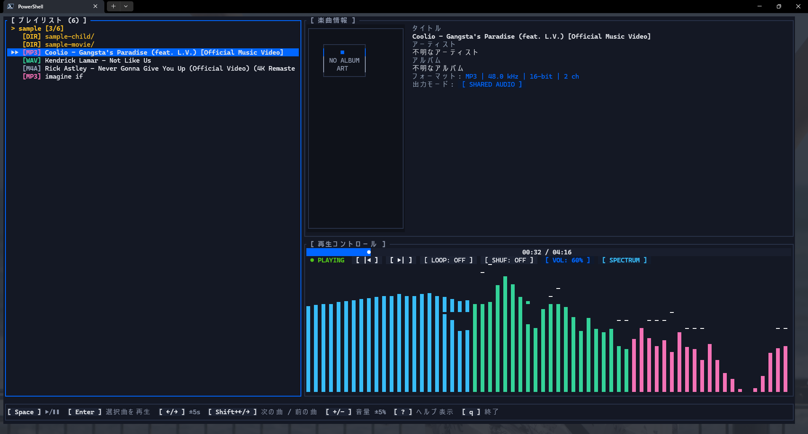

# myuujik



高音質・超軽量なターミナル音楽プレイヤー / High-quality, ultra-lightweight TUI audio player


[](./LICENSE.MIT)

[日本語](#日本語) | [English](#english)

---

## 日本語

### 概要

`myuujik` は、Rust 言語で実装された高音質かつリソースフットプリントの小さいターミナル指向（TUI）オーディオプレイヤーです。
外部の重厚なグラフィカル環境に依存することなく、コンソール上で高品質な音楽再生と直感的なプレイリスト操作を提供いたします。

---

### 主な機能

- **高品質オーディオ再生エンジン**
  - **ピュア Rust デコード**: `symphonia` による各種コーデック（FLAC, MP3, AAC, ALAC, WAV, Ogg Vorbis, Opus）のネイティブデコードに対応しています。
  - **完全ギャップレス再生**: バックグラウンドでの先行デコード（プリロード）により、トラック間の一時停止や音切れのない再生を実現しています。
  - **音量均一化（ReplayGain）**: トラック間の音量差を自動的に補正し、耳に優しい均一な音量で連続再生いたします。
  - **出力モード選択**: Windows 環境における低レイテンシ・高純度の WASAPI 排他モード（Bit-Perfect）および、各 OS 標準の共有モード（`cpal`）の切り替えに対応しています。
  - **10バンド・グラフィックイコライザー**: RBJ Biquad IIR フィルターによる周波数帯域の微調整、プリセット選択、およびバイパス切り替えが可能です。
- **リッチな TUI 表現**
  - **アルバムアート描画**: Kitty, Sixel, iTerm2 各画像プロトコルおよび Unicode ハーフブロック描画を自動検出し、端末内にカバーアートを高精細に表示します。
  - **リアルタイム周波数スペクトラムアナライザ**: Hann 窓関数と Radix-2 FFT を用いた周波数解析グラフを描画します。
  - **同期歌詞表示**: `.lrc` ファイルに基づくタイムスタンプ同期歌詞の自動スクロール表示に対応しています。
  - **マーキースクロール**: 画面枠を超える長い曲名やアーティスト名をスムーズに横スクロール表示します（日本語の全角文字幅セル計算に完全対応）。
- **メディア・メタデータ統合**
  - **音楽 CD（CD-DA）直接再生**: 光学ドライブからの RAW セクター直接読み込みおよび、MusicBrainz API と連携した TOC メタデータとアートワークの自動取得に対応しています。
  - **動画ファイル音声再生**: MP4, WebM 等のコンテナから音声ストリームを抽出し、サムネイル画像をアルバムアートとして自動取得します。
  - **音響指紋による歌詞自動取得**: Chromaprint 音響指紋（AcoustID）と LRCLIB REST API を連携させ、楽曲の同期歌詞をワンキーで自動取得・保存できます。
- **プレイリスト & ライブラリ管理**
  - **マルチフォルダ対応カスタムプレイリスト**: 異なるフォルダの楽曲を自由に集約・保存（M3U8 形式）し、一覧から即座に呼び出せます。
  - **再生予約キュー**: プレイリスト内の楽曲を任意の順序で再生予約できます（キューバッジ `[Q1]`, `[Q2]` 表示）。
  - **インクリメンタル検索**: キー入力と同時にリアルタイムで候補曲を絞り込めます。
  - **お気に入り & 再生履歴**: 楽曲のお気に入り登録および直近の再生履歴を自動保存・永続化します。
- **多言語対応 (i18n)**
  - デフォルト言語は英語（English）となっており、初回起動時には OS の言語環境（日本語環境なら日本語、それ以外なら英語）を自動判定して適用いたします。
  - アプリ実行中に `Shift+L` キーを押すことで、言語を即座に切り替えて設定を自動保存できます。
  - `locales/` ディレクトリに任意の言語ファイル（例: `fr.json`, `zh.json`）を配置するだけで、コアエンジン（`rokeeru-core`）が自動走査して新たな言語として認識いたします。

---

### インストール方法

#### リリースバイナリからの導入
[GitHub Releases](https://github.com/DovahkiinYuzuko/myuujik/releases) ページより、ご利用の OS に適したパッケージをダウンロードしてください。

- **Windows**:
  - `myuujik-windows-x86_64.msi`: インストーラー形式（システム PATH に自動追加されます）
  - `myuujik-windows-x86_64.zip`: ポータブル版アーカイブ
- **Linux**:
  - `myuujik-linux-x86_64.deb`: Debian / Ubuntu 向けパッケージ（`sudo apt install ./myuujik-*.deb`）
  - `myuujik-linux-x86_64.tar.gz`: 汎用バイナリアーカイブ
- **macOS**:
  - `myuujik-macos-aarch64.dmg` / `myuujik-macos-x86_64.dmg`: Apple Silicon / Intel 向けディスクイメージ
  - `myuujik-macos-*.tar.gz`: 汎用バイナリアーカイブ

#### ソースコードからのビルド
Rust 開発環境（Cargo）がインストールされている環境であれば、以下のコマンドでビルド可能です。

```bash
# リポジトリのクローン
git clone https://github.com/DovahkiinYuzuko/myuujik.git
cd myuujik

# Linux 環境の場合のみ ALSA 開発パッケージを事前に導入してください
# Debian/Ubuntu: sudo apt-get install -y libasound2-dev

# ビルドおよびインストール
cargo install --path .
```

---

### 使用方法

```bash
# 楽曲ファイルまたはフォルダを指定して起動
myuujik /path/to/music

# 言語を指定して起動 (ja / en)
myuujik --locale ja /path/to/music

# シャッフル再生を有効にして起動
myuujik --shuffle /path/to/music

# WASAPI 排他モードを強制して起動 (Windows のみ)
myuujik --exclusive /path/to/music

# TUI を起動せず CLI モードで再生検証
myuujik --no-tui /path/to/music
```

※引数を省略して起動した場合、前回終了時のフォルダや再生位置がセッションから自動復元されます。

---

### キー操作一覧

| キー | 動作 |
|---|---|
| `Space` | 再生 / 一時停止 |
| `Enter` | 選択中の楽曲を再生 / モーダル決定 |
| `↑` / `↓` (`k` / `j`) | プレイリスト内のカーソル移動 |
| `←` / `→` | 5秒 巻き戻し / 早送り |
| `Shift+←` / `Shift+→` (`p` / `n`) | 前の曲 / 次の曲 |
| `[` / `]` または `Shift+↑/↓` | 音量調整 (±5%) |
| `Alt+↑` / `Alt+↓` | 選択中の曲順を上下に並び替え |
| `Delete` | 選択曲をプレイリストから除外 |
| `a` | 再生予約キューに追加 / 解除 |
| `r` | リピートモード切替 (全曲 / 1曲 / OFF) |
| `s` | シャッフル再生 ON / OFF |
| `Shift+S` | 現在のリストを M3U8 プレイリストとしてエクスポート |
| `Shift+P` | カスタムプレイリスト管理モーダル表示 |
| `O` | OS 標準のフォルダ選択ダイアログを開く |
| `/` | インクリメンタル楽曲検索モード |
| `f` | 選択曲のお気に入り登録 / 解除 |
| `Shift+F` | お気に入り & 再生履歴モーダル表示 |
| `l` | 同期歌詞表示 / リアルタイム波形表示 切替 |
| `Shift+L` | 表示言語の切り替え (英語 / 日本語 / 追加ロケール) |
| `v` | ビジュアライザー表示モード切替 |
| `d` | 音響指紋による同期歌詞の自動取得 |
| `Shift+D` | 保存されている同期歌詞ファイルの削除 |
| `g` | 10バンド グラフィックイコライザー設定モーダル表示 |
| `e` | 出力モード切替 (Shared / Exclusive) |
| `E` | 出力オーディオデバイス選択モーダル表示 |
| `?` / `h` | ショートカットヘルプ表示 |
| `q` / `Esc` | モーダルを閉じる / アプリケーション終了 |

---

### マウス操作

- **シークバー**: クリックした再生位置へ直接シークします。
- **音量バー**: ホイールスクロールまたはクリックで音量を増減できます。
- **プレイリスト行**: クリックでカーソル移動、ダブルクリックで対象楽曲を即座に再生します。

---

### 設定と保存場所

アプリケーションの設定（音量、出力モード、言語、テーマ、EQ設定、セッション情報）は、各 OS の標準ディレクトリに `config.toml` として保存されます。

- **Windows**: `%APPDATA%\myuujik\config.toml`
- **Linux**: `~/.config/myuujik/config.toml`
- **macOS**: `~/Library/Application Support/myuujik/config.toml`

※実行フォルダ直下に `config.toml` が存在する場合は、ローカルの設定ファイルが優先して読み込まれます（ポータブル運用に対応）。

---

### LICENSE

[MIT](./LICENSE.MIT)

Third-Party → [NOTICE.md](./NOTICE.md)

---

## English

### Overview

`myuujik` is a high-quality, ultra-lightweight terminal-based (TUI) audio player written in pure Rust.
Without relying on heavy desktop environments, it delivers pristine audio reproduction and intuitive playlist controls directly inside your console.

---

### Key Features

- **High-Fidelity Audio Engine**
  - **Pure Rust Decoding**: Native decoding of various codecs (FLAC, MP3, AAC, ALAC, WAV, Ogg Vorbis, Opus) via `symphonia`.
  - **Gapless Playback**: Background decoder preloading ensures smooth, gapless transitions between consecutive tracks without delays or glitches.
  - **Loudness Normalization (ReplayGain)**: Automatically balances loudness differences across various songs for a consistent, comfortable listening level.
  - **Flexible Output Modes**: Supports low-latency WASAPI Exclusive mode (Bit-Perfect) on Windows, and unified shared output via `cpal` across all platforms.
  - **10-Band Graphic Equalizer**: Fine-tune frequency bands using RBJ Biquad IIR filters with built-in presets and instant bypass toggling.
- **Rich Terminal Interface**
  - **Cover Art Rendering**: Auto-detects Kitty, Sixel, iTerm2 protocols, or Unicode half-blocks to display high-resolution album covers inside your terminal.
  - **Real-Time FFT Spectrum Analyzer**: Frequency spectrum visualization using Hann windowing and Radix-2 Fast Fourier Transform.
  - **Synchronized Lyrics**: Smooth scrolling synchronization with `.lrc` timecode lyric files.
  - **Marquee Ticker**: Smooth horizontal scrolling for long track titles and artist names (with full support for double-width CJK character widths).
- **Media & Metadata Integration**
  - **Direct Audio CD Playback**: Direct RAW sector reading from physical CD drives with automatic MusicBrainz TOC metadata and artwork lookups.
  - **Video Container Playback**: Extracts audio tracks directly from containers like MP4 or WebM, using video thumbnails as cover art.
  - **Acoustic Fingerprinting**: Automatically look up and save synchronized lyrics using Chromaprint (AcoustID) and the LRCLIB REST API.
- **Playlist & Library Management**
  - **Multi-Directory Custom Playlists**: Combine tracks from scattered directories into customized playlists (M3U8) and switch between them instantly.
  - **Playback Queue**: Queue upcoming tracks in any order (with visual indicators `[Q1]`, `[Q2]`).
  - **Incremental Search**: Instantly filter track titles and artists in real time as you type.
  - **Favorites & History**: Mark favorite songs and persist recent playback history automatically.
- **Internationalization (i18n)**
  - English is the default language. On the first launch, the player automatically detects your operating system's locale setting (e.g., Japanese on Japanese OS environments, English otherwise).
  - Press `Shift+L` anytime to cycle through available languages on the fly and persist the setting immediately.
  - Simply place any new translation file (e.g., `fr.json`, `zh.json`) inside the `locales/` directory, and the core engine (`rokeeru-core`) will automatically discover and load it.

---

### Installation

#### Pre-built Binaries
Download the installer or archive suitable for your system from the [GitHub Releases](https://github.com/DovahkiinYuzuko/myuujik/releases) page.

- **Windows**:
  - `myuujik-windows-x86_64.msi`: Windows Installer package (automatically added to system PATH)
  - `myuujik-windows-x86_64.zip`: Portable standalone archive
- **Linux**:
  - `myuujik-linux-x86_64.deb`: Debian / Ubuntu package (`sudo apt install ./myuujik-*.deb`)
  - `myuujik-linux-x86_64.tar.gz`: Standalone binary archive
- **macOS**:
  - `myuujik-macos-aarch64.dmg` / `myuujik-macos-x86_64.dmg`: Disk images for Apple Silicon / Intel Macs
  - `myuujik-macos-*.tar.gz`: Standalone binary archive

#### Building from Source
If you have a working Rust development environment with Cargo installed, build the binary with:

```bash
# Clone repository
git clone https://github.com/DovahkiinYuzuko/myuujik.git
cd myuujik

# On Linux, ensure ALSA development headers are installed
# Debian/Ubuntu: sudo apt-get install -y libasound2-dev

# Build and install
cargo install --path .
```

---

### Usage

```bash
# Launch player with a music folder or file
myuujik /path/to/music

# Launch with a specific UI language (ja / en)
myuujik --locale ja /path/to/music

# Enable shuffle mode on launch
myuujik --shuffle /path/to/music

# Force WASAPI Exclusive mode (Windows only)
myuujik --exclusive /path/to/music

# Headless CLI mode for quick audio verification without TUI
myuujik --no-tui /path/to/music
```

*Note: If no path arguments are provided, myuujik automatically restores your last opened folder, track, and playback position from the session state.*

---

### Keyboard Shortcuts

| Key | Description |
|---|---|
| `Space` | Play / Pause |
| `Enter` | Play highlighted track / Confirm modal |
| `↑` / `↓` (`k` / `j`) | Move cursor through playlist |
| `←` / `→` | Seek backward / forward 5 seconds |
| `Shift+←` / `Shift+→` (`p` / `n`) | Previous / next track |
| `[` / `]` or `Shift+↑/↓` | Adjust volume (±5%) |
| `Alt+↑` / `Alt+↓` | Reorder selected track up / down |
| `Delete` | Remove selected track from playlist |
| `a` | Add to / remove from playback queue |
| `r` | Toggle repeat mode (All / Single / Off) |
| `s` | Toggle shuffle mode On / Off |
| `Shift+S` | Export current playlist to M3U8 |
| `Shift+P` | Open Custom Playlist Manager modal |
| `O` | Open native OS folder selection dialog |
| `/` | Incremental track search |
| `f` | Add to / remove from Favorites |
| `Shift+F` | Open Favorites & History modal |
| `l` | Toggle Synchronized Lyrics / Waveform view |
| `Shift+L` | Cycle UI language (English / Japanese / Custom locales) |
| `v` | Cycle Visualizer mode |
| `d` | Automatically fetch lyrics via acoustic fingerprint |
| `Shift+D` | Delete saved synchronized lyrics file |
| `g` | Open 10-Band Graphic Equalizer modal |
| `e` | Switch audio output mode (Shared / Exclusive) |
| `E` | Open audio output device selection modal |
| `?` / `h` | Show keyboard shortcuts help |
| `q` / `Esc` | Close modal / Quit application |

---

### Mouse Controls

- **Seekbar**: Click anywhere on the progress bar to seek directly.
- **Volume**: Scroll the mouse wheel or click to adjust volume.
- **Playlist Rows**: Click to highlight a track, double-click to immediately begin playback.

---

### Configuration & Paths

Application preferences (volume, audio mode, language, theme, EQ parameters, and session data) are stored in `config.toml` within your system's standard configuration directory:

- **Windows**: `%APPDATA%\myuujik\config.toml`
- **Linux**: `~/.config/myuujik/config.toml`
- **macOS**: `~/Library/Application Support/myuujik/config.toml`

*Note: If `config.toml` exists in the current working directory, it will take precedence over the global config, enabling fully portable setups.*

---

### LICENSE

[MIT](./LICENSE.MIT)

Third-Party → [NOTICE.md](./NOTICE.md)
